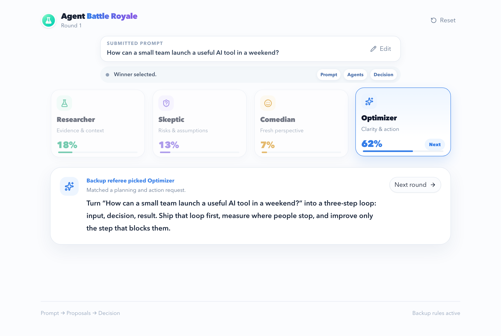

# Agent Battle Royale

An interactive agent-routing demo powered by Jev from TypeSafe AI. Enter a prompt and Jev selects the most suitable specialist:

- Researcher — facts, evidence, context, and comparisons
- Skeptic — critiques, assumptions, weaknesses, and risks
- Comedian — jokes, puns, and playful responses
- Optimizer — plans, improvements, prioritization, and execution

The interface reveals the routing decision in stages, shows each agent's probability, and highlights the selected agent.



## Prerequisites

- Node.js 22.13 or newer
- pnpm 11
- A TypeSafe AI / Jev API key

## Local setup

```bash
pnpm install
cp .env.example .env.local
```

Open `.env.local` and set `TYPESAFE_API_KEY` and `SITES_PROJECT_ID`, then start the app:

```bash
pnpm dev
```

Open the local URL printed by the development server.

`.env.local` is gitignored. `.env.example` is the only env file that should be committed, and it has no key. Do not prefix the variable with `VITE_` — that would expose it to the browser.

## Production

Set `TYPESAFE_API_KEY` as a host secret (for Cloudflare, `wrangler secret put TYPESAFE_API_KEY`). Set `SITES_PROJECT_ID` in the host environment as well. The committed `.openai/hosting.json` keeps `project_id` null; a build writes the env value into `dist/.openai/hosting.json` only. Do not put the key or project id in `wrangler` config or committed source.

```bash
pnpm build
pnpm start
```

## Main files

- `app/page.tsx` — interface, animation stages, agents, and fallback routing
- `app/globals.css` — responsive visual design and animation styles
- `app/api/decision/route.ts` — server-side Jev API integration

The API key is read only on the server through `TYPESAFE_API_KEY`. Never place it in client-side code or commit it to source control.
